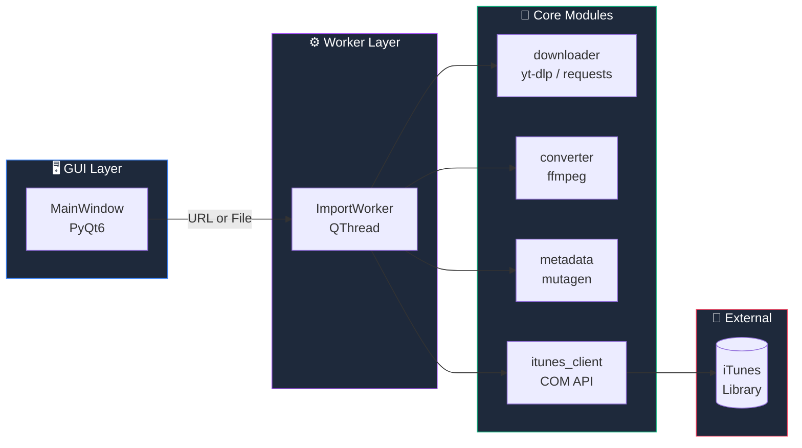

<div align="center">

# 🎵 iTunes Library Helper

### *URLからでも、ファイルからでも。あなたの音楽を最速でライブラリへ。*

<br />

[](LICENSE)
[](https://www.python.org/)
[](#)
[](https://pypi.org/project/PyQt6/)
[](#)

<br />

旧 iTunes の「ファイルを追加」フローは古く、分かりづらく、
**動画URL** や **非対応フォーマット** からの取り込みには毎回手作業が必要でした。
このアプリは、その面倒さをすべて吸収します。

</div>

---

## 📥 ダウンロード

<div align="center">

### 👉 **[最新版 .exe をダウンロード](https://github.com/Assy2005/itunes-library-helper/releases/latest)**

<sub>Windows 10 / 11 ・ Python インストール不要 ・ ダブルクリックで起動</sub>

</div>

---

## ✨ 一目でわかる、できること

<table>
<tr>
<td width="33%" align="center" valign="top">
<h3>🌐</h3>
<b>URLから直接追加</b><br/>
<sub>YouTube等の動画URL、<br/>または <code>.mp3</code> / <code>.wav</code> の直リンクを<br/>貼るだけでライブラリ入り</sub>
</td>
<td width="33%" align="center" valign="top">
<h3>📁</h3>
<b>ドラッグ&ドロップ</b><br/>
<sub>ローカルの音楽ファイルを<br/>まとめてウィンドウに放り込むだけ。<br/>複数ファイル同時OK</sub>
</td>
<td width="33%" align="center" valign="top">
<h3>🔄</h3>
<b>自動フォーマット変換</b><br/>
<sub>FLAC など iTunes 非対応形式は<br/>裏で <code>ffmpeg</code> が AAC/MP3 に<br/>自動変換</sub>
</td>
</tr>
<tr>
<td width="33%" align="center" valign="top">
<h3>🏷️</h3>
<b>メタデータ補完・編集</b><br/>
<sub>アーティスト・アルバム・<br/>アートワークを自動取得 / GUI編集</sub>
</td>
<td width="33%" align="center" valign="top">
<h3>📜</h3>
<b>プレイリスト一括作成</b><br/>
<sub>URLリストやフォルダから<br/>1クリックでプレイリスト化</sub>
</td>
<td width="33%" align="center" valign="top">
<h3>⚡</h3>
<b>非同期処理</b><br/>
<sub>ダウンロード中も UI は固まらない。<br/>QThread でバックグラウンド実行</sub>
</td>
</tr>
</table>

---

## 🏗️ アーキテクチャ



---

## 🚀 クイックスタート

### 動作要件

| 項目 | 要件 |
|------|------|
| **OS** | Windows 10 / 11 |
| **Python** | 3.10 以上 |
| **iTunes** | Microsoft Store 版 もしくは デスクトップ版（必須） |
| **ffmpeg** | フォーマット変換を使う場合のみ |

> ⚠️ 新しい **Apple Music for Windows** 単体ではまだスクリプタブルAPIが提供されていないため、
> 現状は従来の **iTunes** が必要です。

### インストール & 起動

```powershell
# 1. クローン
git clone https://github.com/Assy2005/itunes-library-helper.git
cd itunes-library-helper

# 2. 仮想環境を作成
python -m venv .venv
.\.venv\Scripts\Activate.ps1

# 3. 依存関係をインストール
pip install -r requirements.txt

# 4. 起動！
python -m src.main
```

---

## 📂 プロジェクト構成

```
itunes-library-helper/
├── 📄 README.md
├── 📄 LICENSE                  ← MIT
├── 📄 requirements.txt
├── 📄 .gitignore
└── 📁 src/
    ├── 🐍 main.py              ← エントリポイント
    ├── 🍎 itunes_client.py     ← iTunes COM API ラッパー
    ├── 🌐 downloader.py        ← yt-dlp / 直リンク ダウンローダ
    ├── 🔄 converter.py         ← ffmpeg フォーマット変換
    ├── 🏷️  metadata.py          ← mutagen タグ読み書き
    └── 📁 gui/
        └── 🖥️  main_window.py    ← メインウィンドウ
```

---

## 🛠️ 使用技術

<div align="center">

| カテゴリ | ライブラリ | 役割 |
|:--:|:--:|:--|
| **GUI** | [PyQt6](https://pypi.org/project/PyQt6/) | デスクトップUI |
| **iTunes連携** | [pywin32](https://pypi.org/project/pywin32/) | COM API 経由でライブラリ操作 |
| **動画/音声DL** | [yt-dlp](https://github.com/yt-dlp/yt-dlp) | YouTube等から音源抽出 |
| **HTTP** | [requests](https://pypi.org/project/requests/) | 直リンク・アートワーク取得 |
| **タグ** | [mutagen](https://pypi.org/project/mutagen/) | ID3 / FLAC / MP4 タグ編集 |
| **変換** | [ffmpeg](https://ffmpeg.org/) (via [ffmpeg-python](https://pypi.org/project/ffmpeg-python/)) | フォーマット変換 |

</div>

---

## 🗺️ ロードマップ

- [x] プロジェクトスケルトン
- [x] URL / ファイル取り込みの基本フロー
- [x] 非同期 (QThread) 処理
- [ ] メタデータ編集ダイアログ
- [ ] アートワーク自動取得 (iTunes Search API)
- [ ] プレイリスト一括作成 UI
- [ ] yt-dlp / ffmpeg 進捗バー
- [ ] 設定画面 (出力フォルダ / 音質 / デフォルト変換先)
- [ ] PyInstaller でのワンファイル配布

---

## 🤝 コントリビュート

Issue / PR 歓迎です。バグ報告や機能リクエストはお気軽にどうぞ。

---

<div align="center">

## 📜 ライセンス

[**MIT License**](LICENSE)

<br/>

<sub>Made with ☕ and a long-standing frustration with iTunes' "Add File" dialog.</sub>

</div>
