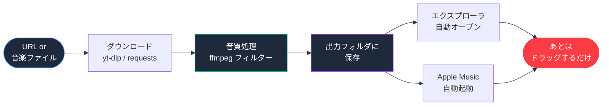

<div align="center">

# 🎵 Apple Music Library Helper

### *URLからでも、ファイルからでも。あなたの音楽を最速で Apple Music へ。*

<br />

[](LICENSE)
[](https://www.python.org/)
[](#)
[](#)
[](https://pypi.org/project/PyQt6/)

<br />

Apple Music for Windows は良いアプリですが、**「動画URLから音源を取って取り込む」「FLACなど未対応形式を変換して取り込む」「重低音やノイズ除去をかけて取り込む」**といったワークフローはサポートされていません。
このツールはそこを埋めます — URL を貼る or ファイルを放り込むだけで、高音質化された .m4a が出来上がり、Apple Music にドラッグするだけの状態でお膳立てします。

</div>

---

## 📥 ダウンロード

<div align="center">

### 👉 **[最新版 .exe をダウンロード](https://github.com/Assy2005/itunes-library-helper/releases/latest)**

<sub>Windows 10 / 11 ・ Python インストール不要 ・ ダブルクリックで起動</sub>

</div>

---

## ✨ 一目でわかる、できること

<table>
<tr>
<td width="33%" align="center" valign="top">
<h3>🌐</h3>
<b>URLから直接取り込み</b><br/>
<sub>YouTube等の動画URL、<br/>または <code>.mp3</code> / <code>.wav</code> の直リンクを<br/>貼るだけで音源化</sub>
</td>
<td width="33%" align="center" valign="top">
<h3>📁</h3>
<b>ドラッグ&ドロップ</b><br/>
<sub>ローカルの音楽ファイルを<br/>まとめてウィンドウに放り込むだけ。<br/>複数ファイル同時OK</sub>
</td>
<td width="33%" align="center" valign="top">
<h3>🎚️</h3>
<b>音質プリセット & カスタム</b><br/>
<sub>原音忠実 / ポップ / EDM・重低音 /<br/>ボーカル強調 / クリア・高解像度<br/>+ 全項目カスタム</sub>
</td>
</tr>
<tr>
<td width="33%" align="center" valign="top">
<h3>🔊</h3>
<b>重低音強化 & 高音強化</b><br/>
<sub>ffmpegフィルターで<br/>bass +12dB / treble +6dB まで<br/>段階的にブースト</sub>
</td>
<td width="33%" align="center" valign="top">
<h3>🎛️</h3>
<b>ノイズ除去 & 音量正規化</b><br/>
<sub>FFTデノイズ、EBU R128 ラウドネス、<br/>ダイナミクス補正、アップサンプリングを<br/>自由に組み合わせ</sub>
</td>
<td width="33%" align="center" valign="top">
<h3>🎵</h3>
<b>Apple Music 取り込み補助</b><br/>
<sub>処理完了後、エクスプローラで<br/>ファイル選択 + Apple Music 起動を<br/>自動実行 → ドラッグするだけ</sub>
</td>
</tr>
</table>

---

## 🎚️ 音質プリセット

| プリセット | ビットレート | 主な処理 | 向いている音楽 |
|---|---|---|---|
| **原音忠実** | 320 kbps | 処理なし | クラシック・ジャズ・ハイレゾ |
| **ポップ** | 256 kbps | 低音+3dB / 高音+2dB / ダイナミクス補正 | J-POP・洋楽ポップス |
| **EDM・重低音** | 320 kbps | 低音+8dB / ラウドネス正規化 | EDM・HipHop・ダンス |
| **ボーカル強調** | 256 kbps | 高音+4dB / ノイズ除去 / ラウドネス正規化 | アコースティック・歌モノ |
| **クリア・高解像度** | 320 kbps | 軽いノイズ除去 / 48kHz アップサンプリング | 全般・配信音源の底上げ |
| **カスタム** | 128–320 kbps | 全パラメータ手動調整 | こだわり派 |

---

## 🔄 ワークフロー



---

## ❓ なぜ「ドラッグするだけ」止まり？

**Apple Music for Windows には外部から自動でライブラリ追加するための公式APIが存在しません。** (Apple Developer Forum 公式回答)

旧iTunesにあった COM インターフェースは新 Apple Music アプリには引き継がれず、AppleScript は macOS 限定、Microsoft Store版 Apple Music もスクリプタブルではありません。Apple Music API (REST) は **カタログ曲をライブラリに紐付ける** ことしかできず、任意のローカルファイルをアップロードするエンドポイントはありません。

このツールは「最後のドラッグ操作だけは人間がする」前提で、それ以外の面倒な部分 (URL DL / 変換 / 音質処理 / フォルダ整理 / Apple Music 起動) を全自動化することで、実用上限まで近づけたものです。

---

## 🚀 クイックスタート

### 動作要件

| 項目 | 要件 |
|------|------|
| **OS** | Windows 10 / 11 |
| **Apple Music for Windows** | Microsoft Store から無料インストール |
| **ffmpeg** | 音質処理 / フォーマット変換に必須 |
| **Python** | exe を使う場合は不要。ソースから動かす場合は 3.10+ |

### exe版 (推奨)

[Releases](https://github.com/Assy2005/itunes-library-helper/releases/latest) から `itunes-library-helper.exe` をダウンロードしてダブルクリック。

### ソースから起動

```powershell
git clone https://github.com/Assy2005/itunes-library-helper.git
cd itunes-library-helper
python -m venv .venv
.\.venv\Scripts\Activate.ps1
pip install -r requirements.txt
python -m src.main
```

### ビルド

```powershell
.\build.ps1
# → dist\itunes-library-helper.exe
```

---

## 📂 プロジェクト構成

```
itunes-library-helper/
├── 📄 README.md
├── 📄 LICENSE                  ← MIT
├── 📄 requirements.txt
├── 📄 itunes-library-helper.spec
├── 📄 build.ps1
├── 📁 .github/workflows/       ← タグpushで自動ビルド&リリース
└── 📁 src/
    ├── 🐍 main.py               ← エントリポイント
    ├── 🎚️  audio_presets.py      ← プリセット定義
    ├── 🌐 downloader.py         ← yt-dlp / 直リンクDL
    ├── 🔄 converter.py          ← ffmpeg フィルターチェーン
    ├── 🏷️  metadata.py           ← mutagen タグ操作
    ├── 🎵 apple_music_helper.py ← エクスプローラ&アプリ起動
    ├── ⚙️  settings.py           ← QSettings 永続化
    └── 📁 gui/
        ├── 🖥️  main_window.py    ← メインウィンドウ
        └── 🎨 style.py          ← Apple Music 風 QSS
```

---

## 🛠️ 使用技術

<div align="center">

| カテゴリ | ライブラリ | 役割 |
|:--:|:--:|:--|
| **GUI** | [PyQt6](https://pypi.org/project/PyQt6/) | デスクトップUI |
| **動画/音声DL** | [yt-dlp](https://github.com/yt-dlp/yt-dlp) | YouTube等から音源抽出 |
| **HTTP** | [requests](https://pypi.org/project/requests/) | 直リンク・アートワーク取得 |
| **タグ** | [mutagen](https://pypi.org/project/mutagen/) | ID3 / FLAC / MP4 タグ編集 |
| **音質処理** | [ffmpeg](https://ffmpeg.org/) | フィルターチェーン |
| **パッケージング** | [PyInstaller](https://pyinstaller.org/) | onefile .exe |

</div>

---

## 🗺️ ロードマップ

- [x] プロジェクトスケルトン
- [x] URL / ファイル取り込みの基本フロー
- [x] 非同期 (QThread) 処理
- [x] PyInstaller でのワンファイル配布
- [x] 音質プリセット 5種 + カスタム (bass / treble / denoise / loudnorm / dynaudnorm / resample)
- [x] Apple Music 風 GUI (タブ + カードUI + ピンクアクセント)
- [x] 設定の永続化 (QSettings)
- [x] Apple Music 取り込み補助 (エクスプローラ自動表示 + Apple Music 自動起動)
- [x] **iTunes 依存を完全除去、Apple Music 専用化**
- [ ] OLE Drag&Drop シミュレーションで Apple Music 完全自動化 (R&D)
- [ ] yt-dlp / ffmpeg 進捗の詳細表示
- [ ] メタデータ編集ダイアログ
- [ ] アートワーク自動取得 (iTunes Search API)
- [ ] プレイリスト一括作成 UI
- [ ] ダーク/ライト切り替え
- [ ] アプリアイコン

---

## 🤝 コントリビュート

Issue / PR 歓迎です。バグ報告や機能リクエストはお気軽にどうぞ。

---

<div align="center">

## 📜 ライセンス

[**MIT License**](LICENSE)

<br/>

<sub>Made with ☕ and a long-standing frustration with music import workflows on Windows.</sub>

</div>
